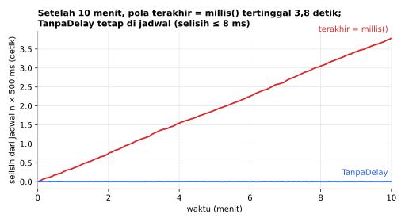
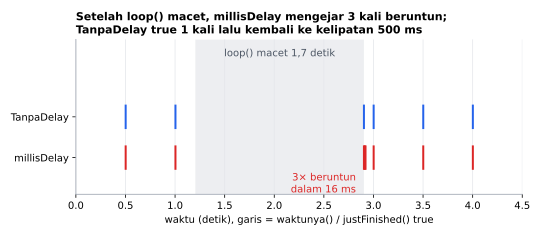
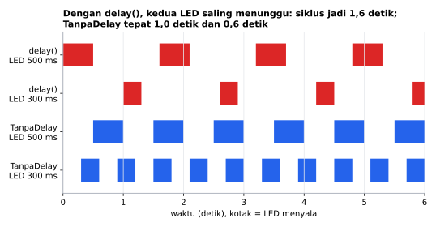

# TanpaDelay

[English](README.en.md)

Library Arduino berbahasa Indonesia untuk **mengganti `delay()`**: jalankan beberapa hal bersamaan tanpa program berhenti. Cukup satu `if`, tanpa menghitung `millis()` sendiri, dan hanya **9 byte RAM per objek**.

```cpp
TanpaDelay kedip(500);

if (kedip.waktunya()) ...   // true setiap 500 ms
```

## Fitur

- **Seperti kalimat biasa**: `if (kedip.waktunya())`, `matikan.setelah(10000)`, `if (matikan.selesai())`.
- **Tanpa callback**: kodenya tetap di dalam `loop()`, mudah dibaca pemula.
- **Berkala tanpa drift**: jadwal maju tepat kelipatan interval, tidak bergeser walau `loop()` lambat.
- **Tidak mengejar** saat `loop()` sempat macet: `waktunya()` hanya true sekali, lalu kembali ke irama semula.
- **Sekali jalan** untuk lampu mati otomatis, batas waktu, atau tunda aksi.
- **`sisaWaktu()`** untuk menampilkan hitung mundur.
- **Hemat RAM**: 9 byte per objek di Arduino Uno, tanpa alokasi dinamis.
- Aman saat `millis()` meluap (setelah ±49 hari menyala).

## Board yang didukung

| Board | Teruji compile |
|---|---|
| Arduino Uno / Nano | ✅ |
| Arduino Mega | ✅ |
| ESP32 DevKit | ✅ |
| ESP32-C3 / S3 | ✅ |
| STM32 Blackpill F411 | ✅ |
| STM32 Bluepill F103 | ✅ |

Library ini hanya memakai `millis()`, jadi seharusnya bekerja di semua board Arduino.

## Instalasi

**Library Manager:** Arduino IDE → *Sketch → Include Library → Manage Libraries…* → cari **TanpaDelay** → *Install*.

**Manual:** unduh ZIP dari GitHub → *Sketch → Include Library → Add .ZIP Library…*

## Kenapa jangan `delay()`?

Selama `delay(1000)`, Arduino tidak mengerjakan apa pun: tombol tidak terbaca, sensor tidak dibaca, LED lain tidak berkedip. Dengan TanpaDelay, `loop()` terus berputar ribuan kali per detik, dan tiap pekerjaan hanya dijalankan saat waktunya tiba.

```cpp
// Dengan delay(): LED kedua ikut menunggu LED pertama.
digitalWrite(13, HIGH); delay(500);
digitalWrite(13, LOW);  delay(500);

// Dengan TanpaDelay: dua LED berjalan sendiri-sendiri.
if (cepat.waktunya())  digitalWrite(8, nyala8 = !nyala8);
if (lambat.waktunya()) digitalWrite(9, nyala9 = !nyala9);
```

Contoh `PerbandinganDelay` menampilkan selisihnya langsung di Serial Monitor.

## Contoh cepat

```cpp
#include <TanpaDelay.h>

TanpaDelay kedip(500);   // setiap 500 ms
TanpaDelay lapor(2000);  // setiap 2 detik
bool nyala = false;

void setup() {
  Serial.begin(115200);
  pinMode(LED_BUILTIN, OUTPUT);
}

void loop() {
  if (kedip.waktunya()) {
    nyala = !nyala;
    digitalWrite(LED_BUILTIN, nyala);
  }
  if (lapor.waktunya()) {
    Serial.println(analogRead(A0));
  }
}
```

## Hasil simulasi



Simulasi `loop()` yang butuh 5–9 ms (rata-rata 7 ms) dengan interval 500 ms. Pola `terakhir = millis()` menghitung jadwal dari saat diperiksa, jadi keterlambatan tiap kejadian menumpuk menjadi 3,8 detik setelah 10 menit. TanpaDelay tidak pernah lebih dari 8 ms dari jadwal.



`loop()` tertahan 1,7 detik satu kali. millisDelay (SafeString, dengan `repeat()`) mengejar interval yang terlewat dengan 3 kejadian beruntun dalam 16 ms. TanpaDelay hanya true sekali, lalu kembali ke kelipatan 500 ms.



Dengan `delay()`, LED kedua menunggu LED pertama selesai, sehingga keduanya berkedip dengan siklus 1,6 detik. Dengan TanpaDelay (seperti contoh `DuaLEDBedaKecepatan`), siklusnya tepat 1,0 dan 0,6 detik.

Grafik dibuat dari simulasi di PC yang menjalankan kode library ini (`extras/simulasi`):
```sh
cd extras/simulasi
python gambar.py   # butuh g++ dan matplotlib
```

## Kecepatan & memori

Diukur dengan simavr (simulator ATmega328P yang akurat per siklus) di Arduino Uno 16 MHz, interval 10 ms. "Belum waktunya" adalah jalur yang paling sering (hampir setiap `loop()`); "kejadian" memajukan `millis()` 10 ms di setiap panggilan (±24 siklus ikut terhitung). Termasuk pemanggilan `millis()` itu sendiri.

| | TanpaDelay 1.0.1 | TanpaDelay 1.0.0 | NoDelay 2.2.0 | Neotimer 1.1.6 | arduino-timer 3.0.1 |
|---|---|---|---|---|---|
| Belum waktunya | 98 siklus (6 µs) | 98 | 108 | 84 | 246 |
| Kejadian | 149 (9 µs) | 725 (45 µs) | 139 | 130 | 329 |
| RAM per objek | 9 B | 9 B | 16 B | 13 B | 16 B (`Timer<1>`) |
| Flash tambahan | 302 B | 254 B | 180 B | 254 B | 430 B |

`waktunya()` O(1) waktu dan memori. Di 1.0.1 jalur kejadian tidak lagi memakai modulo 32 bit (±600 siklus di AVR) kecuali `loop()` benar-benar terlambat lebih dari satu interval, jadi kejadian 5× lebih cepat dengan jadwal tetap tanpa drift.

Di mana kita kalah: Neotimer ±15 siklus lebih cepat di jalur tunggu dan NoDelay/Neotimer ±10–20 siklus di jalur kejadian, karena mereka hanya menulis `start = millis()`. Itulah sumber drift di tabel di bawah; TanpaDelay butuh satu pembanding lagi untuk tetap di jadwal dan tidak mengejar setelah macet. NoDelay ±120 B lebih kecil di flash.

Mengulang pengukuran: sketch `extras/benchmark/TanpaDelayBenchmark` (butuh simavr).

## Sekali jalan

Untuk "lakukan sesuatu X detik lagi", pakai `setelah()` lalu periksa `selesai()`:

```cpp
TanpaDelay matikan;

void loop() {
  if (digitalRead(TOMBOL) == LOW) {
    digitalWrite(LAMPU, HIGH);
    matikan.setelah(10000);   // ditekan lagi = hitungan diulang
  }
  if (matikan.selesai()) digitalWrite(LAMPU, LOW);
}
```

`selesai()` hanya true sekali, lalu objek berhenti sampai `setelah()` atau `mulai()` dipanggil lagi.

## Referensi fungsi

### Dasar

| Fungsi | Keterangan |
|---|---|
| `TanpaDelay(uint32_t ms)` | Berkala setiap `ms`. Hitungan dimulai sejak board menyala. |
| `TanpaDelay()` | Belum jalan. Mulai nanti dengan `setelah()` atau `setiap()`. |
| `bool waktunya()` | `true` sekali setiap interval (berkala), atau sekali saat waktu habis (sekali jalan). Panggil di setiap `loop()`. |
| `bool selesai()` | Sama dengan `waktunya()`, lebih enak dibaca untuk sekali jalan. |

### Mengatur

| Fungsi | Keterangan |
|---|---|
| `setiap(uint32_t ms)` | Jadikan berkala setiap `ms`, dihitung dari sekarang. |
| `setelah(uint32_t ms)` | Sekali jalan, `ms` dari sekarang. Memanggil lagi sebelum habis = hitungan diulang. |
| `mulai()` | Ulang hitungan dari sekarang, mode (berkala / sekali) tetap. |
| `berhenti()` | `waktunya()` selalu `false` sampai `mulai()`, `setiap()`, atau `setelah()`. |
| `ubahInterval(uint32_t ms)` | Ganti interval tanpa mengulang hitungan. Aman dipanggil di setiap `loop()`. |

### Status

| Fungsi | Keterangan |
|---|---|
| `bool sedangJalan()` | `true` jika sedang menghitung. Sekali jalan menjadi `false` setelah `selesai()`. |
| `uint32_t sisaWaktu()` | Sisa waktu (ms) sampai `waktunya()` true. `0` jika sudah waktunya atau berhenti. |

Interval `0` artinya `waktunya()` true di setiap panggilan.

## Saat `loop()` sempat macet

Misalnya interval 500 ms, tapi `loop()` tertahan 2,6 detik (menunggu Serial, sensor lambat, dll.):

- `waktunya()` **true sekali saja**, bukan lima kali beruntun.
- Jadwal berikutnya tetap di kelipatan 500 ms dari awal (irama tidak bergeser).

Jadi LED tidak berkedip cepat tak beraturan untuk "mengejar" yang terlewat, dan motor atau pompa tidak dinyalakan berkali-kali sekaligus.

## Contoh yang tersedia

*File → Examples → TanpaDelay*

| Contoh | Isi |
|---|---|
| `KedipTanpaDelay` | LED bawaan berkedip tanpa `delay()`. |
| `DuaLEDBedaKecepatan` | Dua LED dengan kecepatan berbeda. |
| `BacaSensorBerkala` | Baca sensor tiap 2 detik sambil LED berkedip, kecepatan kedip diubah dengan `ubahInterval()`. |
| `SekaliJalan` | Lampu tangga yang mati otomatis 10 detik setelah tombol terakhir ditekan. |
| `PerbandinganDelay` | Jumlah putaran `loop()` per detik: `delay()` dibanding TanpaDelay. |

## Dibanding library lain

Semua library di bawah ini berbahasa Inggris. Temuan diambil dari source code masing-masing:

| Library | Tanpa callback | Berkala tanpa drift | Catatan |
|---|---|---|---|
| **TanpaDelay** | ✅ | ✅ | Tidak mengejar saat `loop()` macet |
| arduino-timer | ❌ | ❌ `start = t` | Timer bawaan memesan 16 slot: 256 B RAM di Uno (diukur) |
| Ticker (sstaub) | ❌ `start()` butuh callback | ❌ `lastTime = currentTime` | |
| TimerEvent | ❌ | ❌ `lastTime = millis()` setelah callback | |
| TaskScheduler | ❌ | — | Penjadwal multitasking: objek `Scheduler` + `Task` |
| NoDelay | ✅ | ❌ `preMills = curMills` | 16 B per objek di Uno (diukur) |
| Neotimer | ✅ | ❌ `repeat()` memanggil `reset()` = `millis()` | 13 B per objek di Uno (diukur) |
| millisDelay (SafeString) | ✅ | ✅ lewat `repeat()` manual | Mengejar berondongan setelah `loop()` macet |
| SimpleTimer (kiryanenko) | ✅ | — | `_start + _interval <= millis()`: berhenti bekerja setelah `millis()` meluap |

"Drift" artinya jadwal berikutnya dihitung dari saat diperiksa, bukan dari jadwal sebelumnya. Jika `loop()` butuh 7 ms, interval 500 ms bisa menjadi 504 ms, dan selisihnya menumpuk terus.

## Pengujian

Logika berkala, drift, loop macet, sekali jalan, dan luapan `millis()` diuji otomatis di PC (`extras/test`) setiap ada perubahan:

```sh
cd extras/test
g++ -std=c++11 -I. -I../../src uji.cpp ../../src/TanpaDelay.cpp -o uji && ./uji
```

## Status

Versi 1.0.1 sudah lolos uji logika otomatis dan compile di 7 board. Library ini murni perangkat lunak (hanya memakai `millis()`). Jika menemukan masalah, silakan buka *issue* di GitHub.

## Lisensi

MIT © 2026 Amadeo Wisesa. Lihat [LICENSE](LICENSE).
